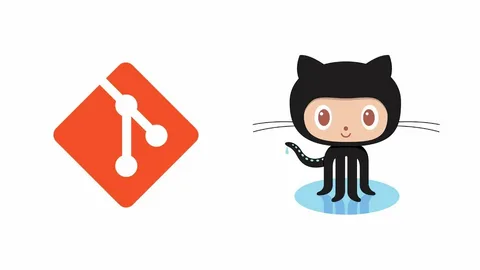
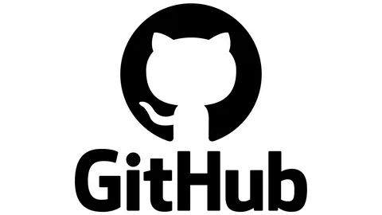
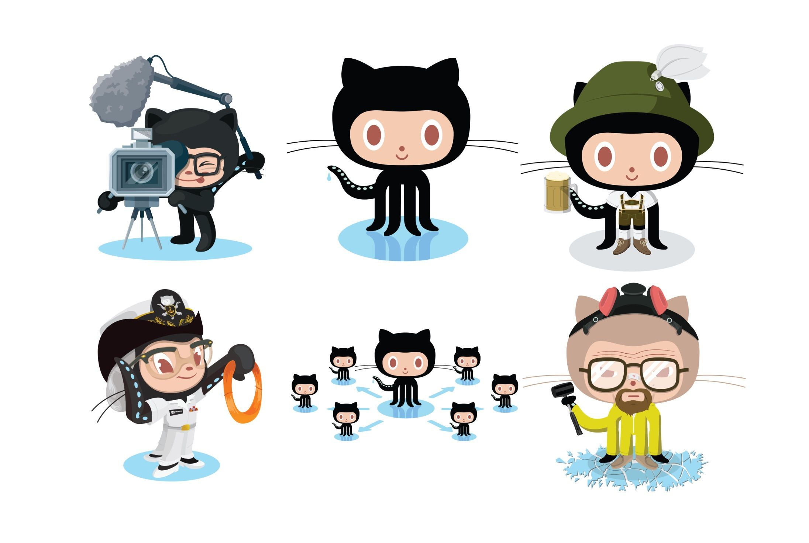
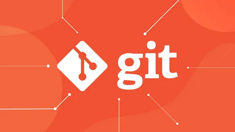

# Git и GitHub – основа для разработчиков 🚀

---
## 🔹 Что такое Git?

- ### Git – это распределённая система управления версиями. Она позволяет отслеживать изменения в коде, работать в команде и откатываться к предыдущим версиям проекта.

## ✅ Основные возможности Git:

### 📌 Отслеживание изменений в файлах.
### 🔄 Откат к предыдущим версиям кода.
### 👥 Совместная работа нескольких разработчиков.
### 📂 Ветвление (branches) для параллельной работы над разными функциями.

---

## 🔹 Что такое GitHub?
- ### GitHub – это онлайн-платформа для хранения и совместной работы над кодом с использованием Git.

### ✅ Преимущества GitHub:
### ☁️ Хранение кода в облаке.
### 🔀 Совместная работа через pull requests.
### 🛠️ Интеграция с CI/CD для автоматизации.
### 👀 Открытые и закрытые репозитории.
### ⭐ Популярное сообщество разработчиков.

---

- # 🎯 Заключение
### Git – это мощный инструмент для контроля версий, а GitHub делает совместную работу проще. Освоение этих технологий – важный шаг для любого программиста! 😊
